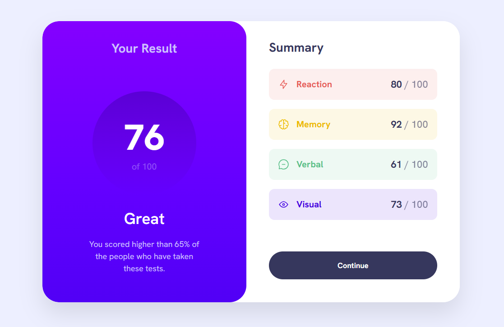
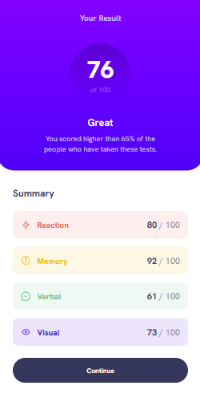

# Frontend Mentor – Results Summary Component

## Summary
This project is my solution to the Results Summary Component challenge on Frontend Mentor. The goal of the challenge is to build a clean, responsive results summary component that matches the original design as closely as possible. I developed this website using HTML and CSS. The layout is responsive and follows a mobile-first-approach. I also used BEM methodology and CSS variables to keep the code organized, scalable, and maintainable. 

## Links
- Live website: [Link to live website](https://master-code234.github.io/results-summary-component/)
## Built With
- HTML5
- CSS
- Flexbox

## Screenshots

### Desktop View

### Mobile View

